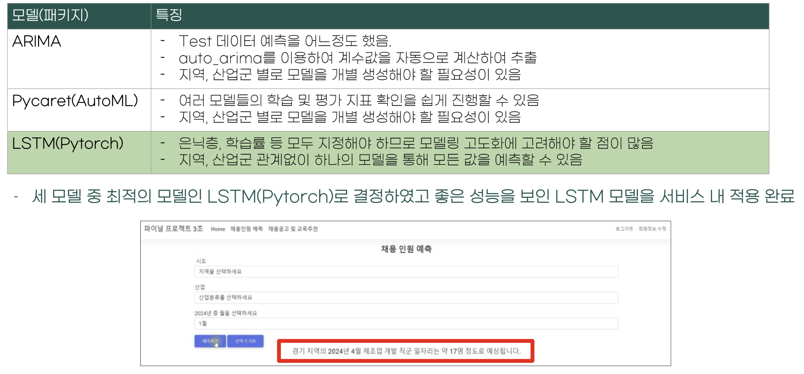

# 일자리 나침반
데이터 분야의 진로를 희망하는 학생 및 취준생을 위한 나침반이 되고자 프로젝트를 진행하였습니다.  

👉🏻[(클릭)서비스시연영상](https://drive.google.com/file/d/14t7dkKiv5BnHfm6_AXKP8uzvH9MUeX1c/view)  
> **디렉토리 설명**  
> - `analysis` : DB 구축, 데이터 수집, 크롤링, ML/DL 수행
> - `venvs` : 웹 실행을 위한 가상환경
> - `Web_service` : Django프레임워크를 활용한 웹 구축
## 서비스 아키텍처

## 서비스 소개
### 1. 24년도 채용 인원 예측
>'24년도에는 몇명의 인원을 채용하게 될까?' 궁금증 해소를 위해 채용 인원을 예측하는 서비스
- 10개년 지역별, 산업별 채용인원과 채용시장에 영향을 미치는 경제지표를 활용. `예측모델을 구축`  

- ARIMA, Pycaret, Pytorch 세가지 모델을 생성, `최종 Pytorch_LSTM`모델 선정

    - 로그변환, 배치정규화, 드롭아웃... 등 하이퍼 파라미터 수정하여 모델 고도화 진행  
    

### 2. 채용공고 및 국비교육 정보 제공
> 데이터 직군별(엔지니어, 분석가, 사이언티스트...)로 어떤 Skill을 길러야 채용시장에서 살아남을 수 있는가?!  

직군마다 사용하는 Skill이 다르고, 같은 직군이라도 회사마다 선호하는 Skill이 다르다니..  
- 직군마다 선호되는 Skill에 대한 정보를 수집, 한눈에 볼 수 있도록 시각화

> Skill강화를 위해 국비교육을 수강하고 싶은데 지역별, 직군별 국비교육을 찾고싶어!
- 지역별, 직군별 채용공고와 국비지원 교육을 한번에 확인!
