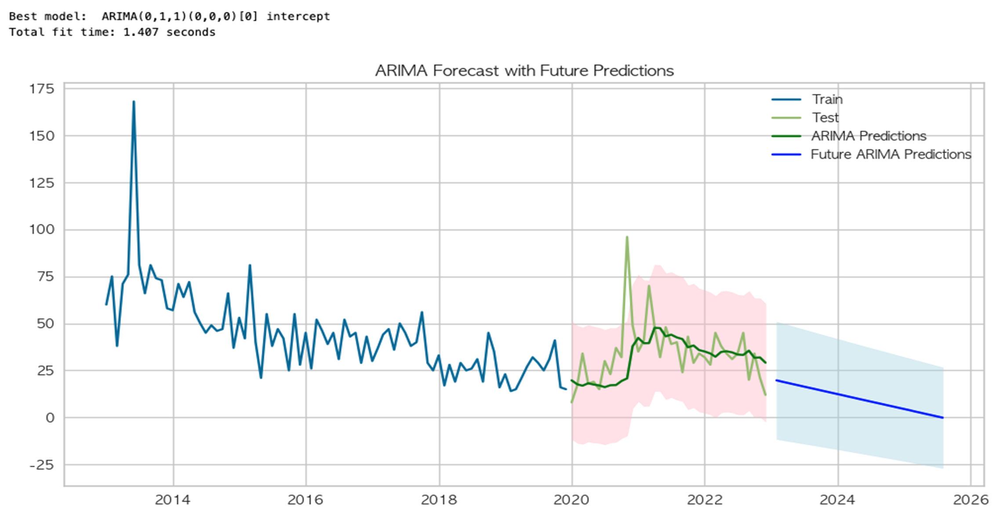
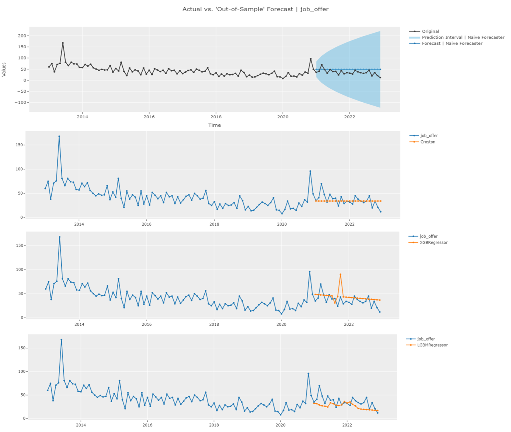
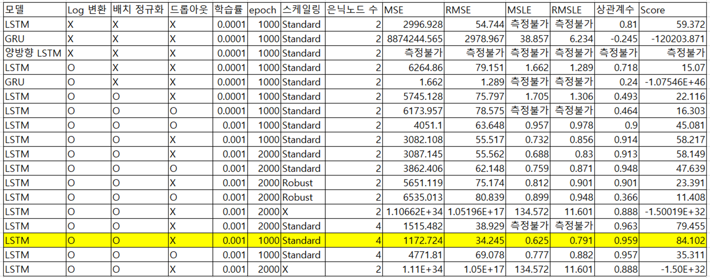
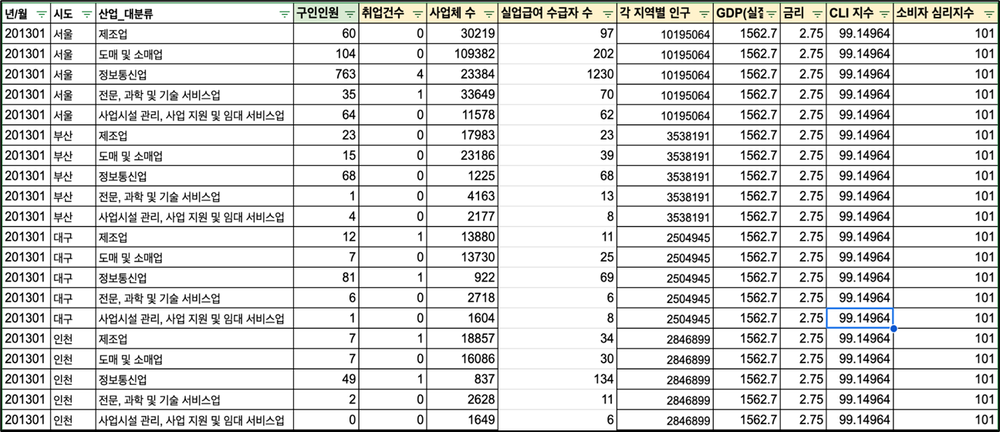

# 디렉토리 설명

## ML/DL
- **pycaret1.ipynb** : 산업군별 데이터직군의 채용인원(job_offer)예측 수행  
: 농업, 부동산업, 숙박 및 음식점업.. 등 데이터직군의 채용인원이 대부분 0  
0 으로 예측하는 경우에도 대부분 일치.. -> 성능이 너무 높아지는 문제점 인식   

- **pycaret2_1_timeseries.ipynb** : 상위 5개 산업군 선정, 다시 예측 진행  
: ARIMA모델을 활용하여 예측 진행, 감소하는 일직선 형태로만 예측..(가장 마지막 관측치 기준 예측)
   

- **pycaret2_2_new.ipynb** : autoML이용, 가장 높은 성능이 나온 Naive, Croston, XGBoost, LightGBM 결과

- **pytorch_lstm(최종모델)** : pycaret의 경우 17개 도시, 5개 산업군마다 모델을 따로 생성해야하는 번거로움.. pytorch LSTM모델 구현

파라미터 조정을 통해 최적의 모델 선정 

## 데이터 수집
- 고용노동부의 고용행정 통계의 산업군별 채용데이터 수집
- 한국은행 및 통계청 등, 경제지표 데이터 수집  
- 국가직무능력표준 웹사이트 내 NCS 코드 수집
- 국비지원 교육과정 데이터 수집(HRD 직업훈련포털)
- NCS Code 내 직업 대분류/중분류/소분류를 통한 직업명 수집

## 채용공고 크롤링
- 채용플랫폼 '원티드'에서 데이터 직군(분석가, 엔지니어, 사이언티스트, 머신러닝엔지니어)의 채용공고 수집
    - url, 지역, 회사명, 우대사항, 기술스택 데이터 수집
- 교육정보와 수집된 공고를 직업별 NCS_code를 기준으로 매핑 

## DB구축
- db_push.ipynb : 수집한 데이터 DB에 적재하는 코드
- db구축.sql : 테이블 생성 및 정의
